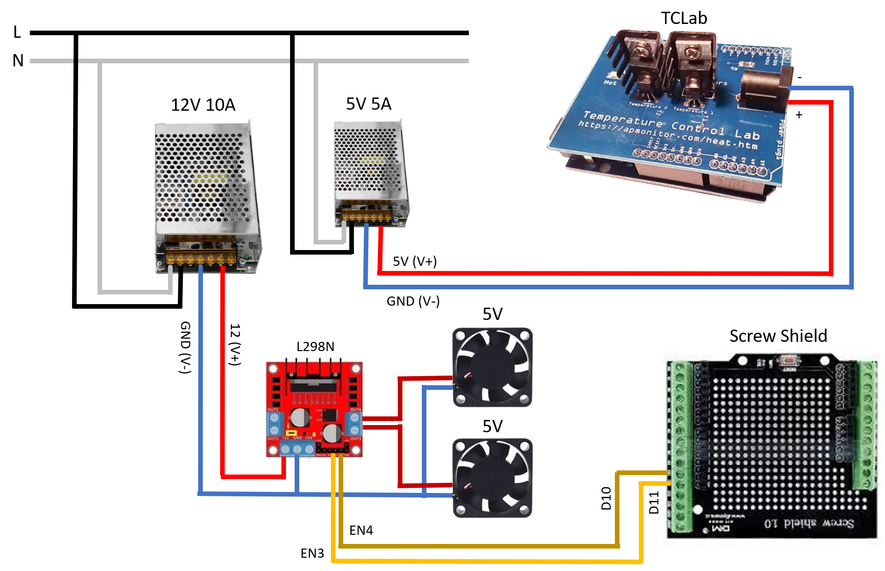

TCLabSP - Temperature Control Laboratory Sao Paulo
==================================================

Este projeto contém os arquivos referentes a um esboço de uma planta didática para controle de temperatura para uso em disciplinas de automação e controle de processos.

SolidWorks2017
---------------------

Esta pasta contém os desenhos da caixa acrílica que servirá de proteção para os componentes.

O desenho descreve uma montagem utilizando chapas acrílicas de 4mm de espessura.

Modelo | Real
-------|-----
|

Descrição dos componentes principais
------------------------------------

Item | Descrição
-----|----------
1 | [TCLab](https://apmonitor.com/heat.htm)
2 | Screw Shield - Extenção de IOs para Arduino
3 | Arduino Uno
4 | Ventilador 1 - 40mm 5V
5 | Ventilador 2 - 40mm 5V
6 | Conector mini USB

*Abaixo é possível encontrar a lista completa de componentes utilizados.

TCLab
-----

Segue abaixo uma pequena descrição dos componentes do [TCLab](https://apmonitor.com/heat.htm).

Item | Descrição
-----|----------
1 | Aquecedor 1
2 | Sensor de temperatura 1
3 | Aquecedor 2
4 | Sensor de temperatura 2
5 | Superfície entre dissipadores** (2cm^2)
6 | Entrada para alimentação

**A superfície entre dissipadores recebe aqui destaque especial pois é através dela que se dá a radiação de calor entre os sistemas, tornando então possível que esses dois conjuntos de 'Aquecedor + Sensor de Temperatura' formem um sistema MIMO (Multiple Input Multiple Output)

Esquema de ligação
------------------

Geral | Macro
------|------
 | 

Simulink R2016a
---------------

A pasta 'Simulink (MATLAB R2016a)' contém alguns arquivos de modelos úteis para a realização de coleta de dados de temperatura.

Arquivos |
---------|
A00_Basic.slx |
A01_Heater1_Random.slx |
A02_Heater2_Random.slx |
A03_Heater1Heater2_Random.slx |
A99_Cooling.slx |

A sub-pasta **Resultados** contém alguns dados coletados utilizando os arquivos acima.

Lista completa de componentes do TCLabSP
-----------------------------

Item | Descrição | Link
-----|-----------|------
1 | TCLab | [link](https://apmonitor.com/heat.htm)
2 | Screw Shield | [link](https://web.archive.org/web/20191111042803/https://produto.mercadolivre.com.br/MLB-917870741-shield-screw-placa-borne-terminal-arduino-uno-_JM?quantity=1)
3 | Arduino Uno | [link](https://store.arduino.cc/usa/arduino-uno-rev3)
4 | 2x Ventiladores 40mm 5V | [link](https://web.archive.org/web/20191111043052/https://produto.mercadolivre.com.br/MLB-1202251810-micro-ventilador-40x40x10-mm-fan-cooler-5v-dc-mini-40mm-4cm-_JM?quantity=1&variation=40334730999)
5 | Conector mini USB | [link](https://web.archive.org/web/20191111043156/https://produto.mercadolivre.com.br/MLB-772679980-adaptador-usb-fmea-x-micro-usb-plug-fmea-arcademania-_JM?quantity=1)
6 | Tomada com interruptor e fusível | [link](https://web.archive.org/web/20191111043259/https://produto.mercadolivre.com.br/MLB-975748527-tomada-ac-painel-10a-macho-porta-fusivel-tripola-interruptor-_JM?quantity=1)
7 | Ponte H dupla - L298N | [link](https://web.archive.org/web/20191111043359/https://produto.mercadolivre.com.br/MLB-832765105-driver-motor-ponte-h-dupla-l298n-arduino-pic-automaco-_JM?quantity=1)
8 | Fonte chaveada colmeia 12V 10A | [link](https://web.archive.org/web/20191111043535/https://produto.mercadolivre.com.br/MLB-1129060722-fonte-chaveada-colmeia-12v-10a-120w-entrada-bivolt-led-_JM?quantity=1)
9 | Fonte chaveada colmeia 5V 5A | [link](https://web.archive.org/web/20191111043632/https://produto.mercadolivre.com.br/MLB-959316834-mini-fonte-chaveada-bivolt-5v-5a-25w-raspberry-pi-_JM?quantity=1)
10 | Chapas acrílicas - 4mm | [link](./Acrilico/00_Completo.DWG)