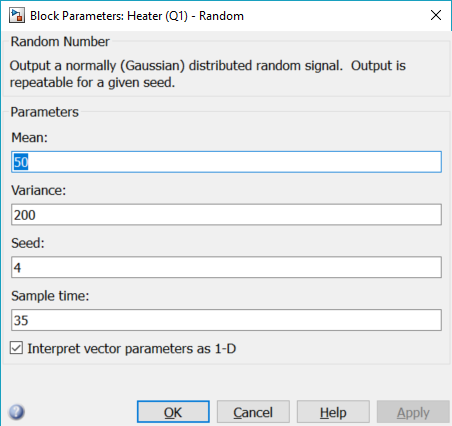

Ensaios com entradas randomicas nos Aquecedores 1 e 2
==============================================

Os resultados contidos nesta pasta foram obtidos utilizando o modelo ```A03_Heater1Heater2_Random.slx```.



